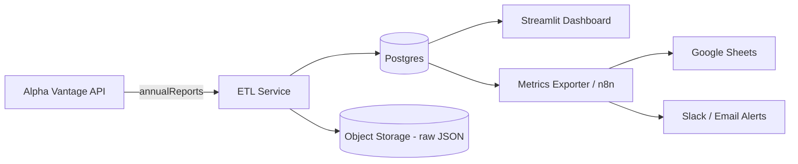

# Production Design & Operations (prod_design.md)

This document explains how to productionize the ETL pipeline described in this repository.
It includes scheduling, an n8n workflow example, rate-limit handling strategies for scaling,
monitoring/alerting ideas, and sample webhook endpoints.

## Architecture Overview (Mermaid)



## Components

- **ETL Service**: Python service (src/*.py) that fetches from Alpha Vantage, transforms, and upserts into Postgres. Runs on schedule (n8n or cron).
- **Postgres**: Primary OLTP store for normalized statements & computed metrics (can run in Docker).
- **Object Storage**: store raw JSON responses for audit & reprocessing (S3/GCS). In this prototype raw JSON is stored in `.cache/`.
- **n8n**: Orchestration/automation layer for scheduled workflows, retries, and notifications.
- **Streamlit**: Simple dashboard for executives/analysts to visualize metrics.
- **Google Sheets**: For ad-hoc exec analysis via either n8n push or BigQuery/Connected Sheets.

## n8n Workflow (step-by-step nodes)

Name: `Monthly Financial ETL`

1. **Cron** node
   - Schedule: `0 6 1 * *` (6:00 AM on the 1st of each month)
2. **HTTP Request** node (Trigger loader)
   - Method: POST
   - URL: `https://etl.example.com/api/v1/refresh` *(internal service endpoint)*
   - Body: `{"tickers": ["TEL","ST","DD"], "mode":"monthly"}`
   - Authentication: API Key (header)
3. **Function** node (optional) - parse the response & decide
4. **Wait / Retry logic** - if response indicates partial success, wait and retry
5. **HTTP Request** node (metrics compute)
   - POST `https://etl.example.com/api/v1/compute_metrics`
6. **IF** node - if response contains errors, -> **Slack** node (notify) else -> **Google Sheets** node (push snapshot)
7. **Google Sheets** node - append rows or replace a sheet tab with the latest metrics
8. **Slack** node - success/failure notification to `#finance-data` channel

### n8n Example: calling a webhook that triggers loader
- Create an HTTP webhook in your ETL service:
  - `POST /api/v1/refresh`
  - Body: `{"tickers": ["AAPL","MSFT"], "force": false}`
- The ETL endpoint authenticates the request and enqueues jobs for each ticker.

## Sample ETL webhook endpoints (Flask-style pseudocode)

```python
# simple Flask endpoints example

from flask import Flask, request, jsonify
from threading import Thread
app = Flask(__name__)

@app.route('/api/v1/refresh', methods=['POST'])
def refresh():
    payload = request.json
    tickers = payload.get('tickers', [])
    force = payload.get('force', False)
    # enqueue a background job (RQ / Celery / simple thread)
    Thread(target=run_loader_for_tickers, args=(tickers, force)).start()
    return jsonify({"status":"accepted", "tickers": tickers}), 202

@app.route('/api/v1/compute_metrics', methods=['POST'])
def compute_metrics():
    Thread(target=compute_all_metrics).start()
    return jsonify({"status":"accepted"}), 202
```

## Scheduling: n8n vs Cron vs Airflow

- **Cron**: simplest. Use for small projects. Works by calling a script on schedule.
- **n8n**: low-code, great for integrating with Sheets/Slack and visibility for non-engineers.
- **Airflow**: use for complex DAGs, heavy dependency management, SLA monitoring.

**Recommendation**: Use n8n to orchestrate and call a containerized ETL microservice. Use a job queue (Redis + RQ or Celery) inside the ETL to scale workers.

## Handling Alpha Vantage Rate Limits for 100 companies

Alpha Vantage free tier: **5 calls/minute, 25 calls/day**.
Each company requires 3 endpoints => 3 calls/company.

Strategies:
1. **Staggered updates**
   - Partition 100 companies into N groups and rotate daily so each company is updated monthly.
   - Example: 100 companies / 25 calls/day ~= 8 groups. Update ~12-13 companies per day (36-39 calls) — still exceeds 25 calls/day.
   - Combine with fetching only changed/necessary endpoints. For example, if cashflow rarely changes, fetch it less often.

2. **Backfill & Cache**
   - Keep raw JSON and only re-fetch when the company `last_updated` is older than threshold (30 days).
3. **Job Queue with Rate-limit coordination**
   - Use a centralized rate-limit token bucket. Workers request tokens before making API calls; tokens are replenished at 5/min.
4. **Pay for a service / bulk dataset**
   - Best long-term. Many providers offer bulk financial statements.

## Google Sheets access patterns

Options:
- **Direct Postgres connection**: Use a Sheets add-on that connects to Postgres (live) — requires secure network & careful auth.
- **BigQuery + Connected Sheets**: Best for enterprises. Sync Postgres -> BigQuery and use Connected Sheets for performant, cached queries.
- **n8n push to Google Sheets**: Scheduled export of latest metrics as rows (no direct DB exposure).

Recommendation:
- For a small team: n8n pushing CSV/rows into a dedicated Google Sheet (easy, auditable).
- For a larger org: sync to BigQuery and use Connected Sheets.

## Monitoring & Alerting

**What breaks first**
- Rate limit exceeded -> API returns Note or 503
- Missing keys in API response -> parsing errors
- DB connection / storage failures

**Monitoring**
- Export metrics (Prometheus) or push logs to a logging service (Datadog/ELK)
- Track: success rate per company, last_success_at, number_of_rate_limit_hits, percent_missing_keys

**Alerts**
- Slack/email on repeated failures or if > X% companies failed in a run
- PagerDuty for production outages (DB down, persistent 5xx from API)

## Data validation checks (examples)

- Number parse success rate (percent of numeric fields parsed)
- Reasonableness checks (revenue > 0 for going-concern)
- Anomaly detection: flag if YoY revenue change > 500% or negative company going from positive to nulls

## Pseudocode: rate-limited worker

```python
# token bucket pseudo
class RateLimiter:
    def __init__(self, calls_per_min=5):
        self.tokens = calls_per_min
        self.last = time.time()
        self.rate = calls_per_min / 60.0

    def get_token(self):
        now = time.time()
        self.tokens += (now - self.last) * self.rate
        self.last = now
        if self.tokens >= 1:
            self.tokens -= 1
            return True
        return False
```

## Final notes

- Keep raw JSON for auditing.
- Implement idempotent upserts.
- For heavier scale, move to a paid financial data provider or bulk data license.
